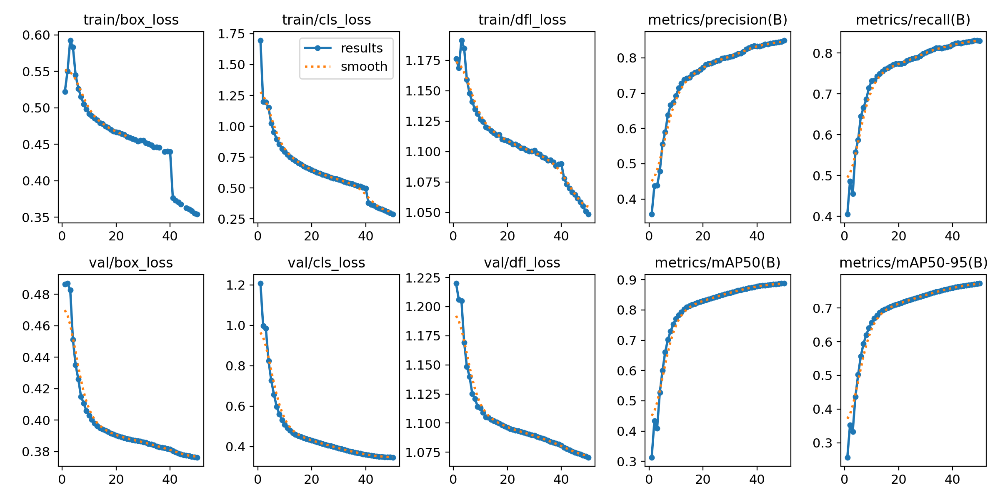
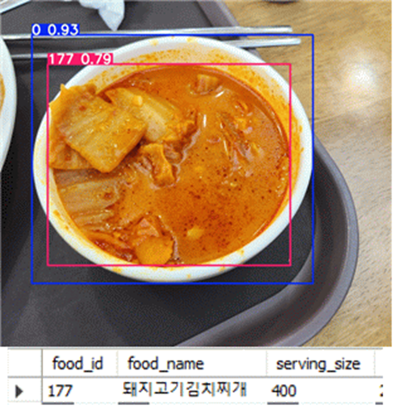
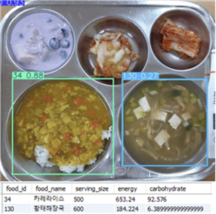

# FoodDetectAI-YOLO
🍽️ YOLO 기반 음식 탐지 AI | AI-powered food detection using YOLO.

## 📂 DataSet  
🔗 **[AI-Hub 음식 이미지 및 영양 정보 데이터셋](https://aihub.or.kr/aihubdata/data/view.do?currMenu=115&topMenu=100&aihubDataSe=realm&dataSetSn=74)**  
🔗 [데이터셋 전처리](preprocessing/README.md)

## 📊 Result
### yolov8l_tiny_640_50.pt

---
### **성능 평가 지표**  
| Metric | 최종값 (Epoch 50) |
|------------|-------------|
| **Precision (정밀도)** | **0.8498** |
| **Recall (재현율)** | **0.8301** |
| **mAP@50 (정확도)** | **0.8879** |
| **mAP@50-95 (정확도)** | **0.7728** |
---
### 결과
|||